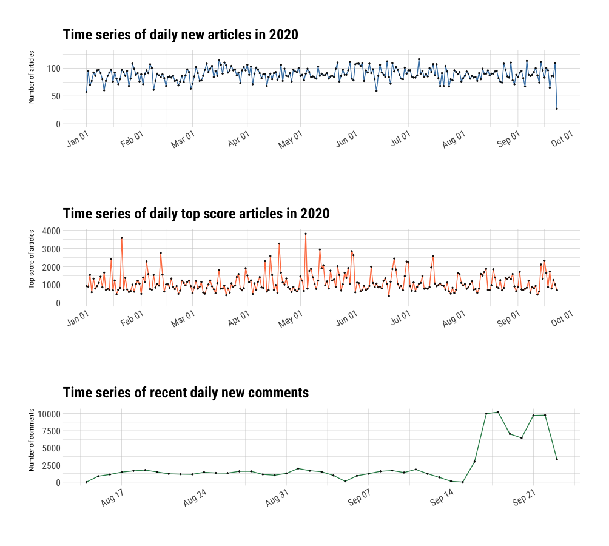

# README

2020-09-24

- The data are re-organized into a directory under `data`, and categorized into:
  - `data/articles.json`
  - `data/comments`
  - `data/content`

- load `tidy_data.RData` to read the following tidy data:
  - `tidy_data`:
    - `time` as date
    - `a_num` as the number of articles on that day
    - `c_num` as the total number of comments on that day
    - `score` as the highest score of a single article on that day

- There are definitely some problems with those given comments data. So I guess the most practical approach is to predict only based on a small portion of data. 

# Challenge 1 - "Warm up predictions"

i didnt do too much on model comparison. especially for the number of comments since the **given** data are missing a lot before August 14.

simply put, I just went full ARIMA (except for the number of comments since the comments number for the last week spiked, ARIMA would return a negative prediction to "balance" this spike, so I used TBATS).

